# Highly Available Web Application on AWS

## Project Overvie

This project demonstrates a highly available web application deployed across multiple AWS Availability Zones using Amazon EC2, EC2 Auto Scaling, an Application Load Balancer, Amazon S3, CloudWatch, IAM and custom VPC networking.

The frontend is a modified version of the website I used in my previous **S3 Static Website** and **Serverless Image Upload** projects. Reusing the same design helped me to focus on changing the underlying infrastructure instead of creating another frontend from scratch.

Unlike the previous projects, this version is served by Apache web servers running on EC2 instances. The Application Load Balancer distributes traffic between instances, while the Auto Scaling Group maintains the required capacity and automatically replaces unhealthy instances.

## Architecture

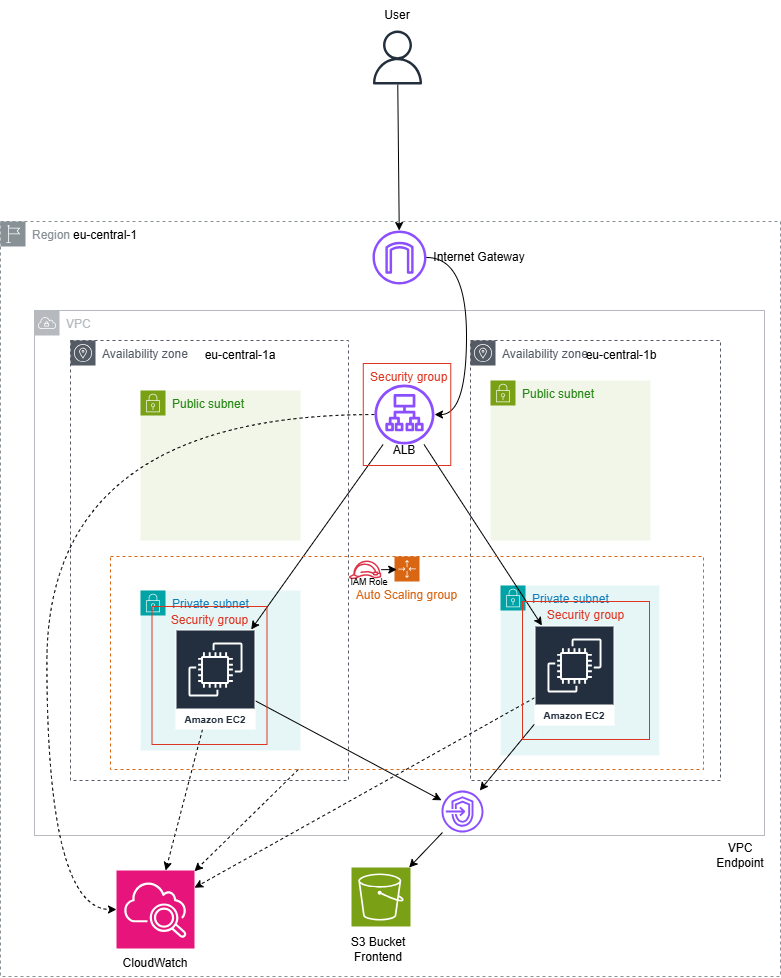

The application was deployed inside a custom VPC in the `eu-central-1` AWS Region.

The VPC contains two public and two private subnets distributed across `eu-central-1a` and `eu-central-1b`. The internet-facing Application Load Balancer uses the public subnets, while the EC2 web servers run inside the private subnets without public IP addresses.

## Request Flow

1. A visitor opens the Application Load Balancer DNS name.
2. The Internet Gateway allows public traffic to reach the ALB.
3. The ALB performs health checks and forwards the request to a healthy EC2 instance.
4. Apache running on the EC2 instance serves the HTML, CSS and JavaScript files.
5. EC2 instances retrieve the latest website files from the private S3 bucket.
6. The S3 Gateway Endpoint allows this access without a NAT Gateway or public internet connection.
7. CloudWatch records metrics for the ALB, EC2 instances and Auto Scaling Group.

## AWS Services Used

### Amazon VPC

A custom VPC was created with the CIDR range `10.20.0.0/16`.

It contains:

- Two public subnets across two Availability Zones
- Two private subnets across two Availability Zones
- An Internet Gateway
- A public route table
- A private route table
- An S3 Gateway VPC Endpoint

The public route table directs internet traffic to the Internet Gateway. The private route table does not contain a default internet route.

### Application Load Balancer

The Application Load Balancer is the public entry point for the application.

It:

- Operates across two public subnets
- Accepts HTTP traffic on port 80
- Distributes requests between EC2 instances
- Checks `/health.html` on each instance
- Stops sending traffic to unhealthy targets

A custom domain and HTTPS certificate were no demonstration, so the application was accessed using the AWS-provided ALB DNS name.

### Amazon EC2 and Apache

Apache HTTP Server runs on each EC2 instance and serves the website files over HTTP.

A temporary EC2 builder instance was used to install Apache, configure the website and verify that the application worked. A custom Amazon Machine Image was then created from that configured instance.

This AMI allows Auto Scaling to launch identical web servers without me manually configuring every instance.

### EC2 Auto Scaling

The Auto Scaling Group spans the two private subnets.

Its capacity was configured as:

- Minimum capacity: 2
- Desired capacity: 2
- Maximum capacity: 4

A target-tracking scaling policy monitors average CPU utilization with a target value of 50%.

The Auto Scaling Group also uses load-balancer health checks. If an instance becomes unhealthy or is terminated, Auto Scaling launches a replacement to restore the desired capacity.

### Amazon S3

The private S3 bucket stores the shared frontend files:

- `index.html`
- `styles.css`
- `script.js`
- `404.html`
- `health.html`

This bucket was reused from my earlier AWS web projects.

The browser does not access S3 directly. Instead, each EC2 instance uses its IAM role to download the files and Apache serves them to visitors.

### S3 Gateway VPC Endpoint

The private EC2 instances do not have public IP addresses and the architecture does not use a NAT Gateway.

An S3 Gateway VPC Endpoint was associated with the private route table. This provides private connectivity between the EC2 instances and the S3 bucket without sending S3 traffic through the public internet.

### AWS Identity and Access Management

The EC2 instances use an IAM role with a least-privilege policy.

The role permits the instances to:

- List the specific website bucket
- Read objects from that bucket

It does not allow the instances to modify or delete S3 objects. No access keys were stored inside the scripts or EC2 instances.

### Amazon CloudWatch

CloudWatch was used to monitor:

- ALB request count
- Number of healthy EC2 targets
- Application response time
- Auto Scaling desired capacity
- Auto Scaling in-service instances
- Average EC2 CPU utilization

A CloudWatch alarm was configured to enter the alarm state when the ALB had fewer than two healthy targets.

## Security Design

The application uses separate security groups for the ALB and EC2 instances.

The ALB security group accepts HTTP traffic from the internet on port 80.

The EC2 security group accepts HTTP traffic only from the ALB security group. The EC2 instances do not accept direct public HTTP or SSH traffic.

Additional security decisions include:

- EC2 instances run in private subnets
- Auto Scaling instances have no public IP addresses
- S3 Block Public Access remains enabled
- EC2 uses an IAM role instead of permanent credentials
- S3 access is limited to the required bucket
- IMDSv2 is required in the launch template
- EBS storage is deleted when instances are terminated
- No NAT Gateway was required

## High-Availability Test

To verify that the architecture could recover from failure, I manually terminated one EC2 instance belonging to the Auto Scaling Group.

During the test:

1. The ALB continued routing traffic to the remaining healthy instance.
2. CloudWatch detected that the healthy target count had fallen below two.
3. The health alarm entered the alarm state.
4. The Auto Scaling Group launched a replacement instance.
5. The replacement downloaded the website files from S3.
6. Apache started and passed the ALB health check.
7. The target group returned to two healthy instances.
8. The CloudWatch alarm returned to the OK state.

This demonstrated both application availability and automatic recovery.

## Repository Structure

```text
aws-highly-available-web-app/
├── frontend/
│   ├── index.html
│   ├── styles.css
│   ├── script.js
│   ├── 404.html
│   └── health.html
├── scripts/
│   ├── prepare-ami.sh
│   └── instance-user-data.sh
├── policies/
│   ├── ec2-s3-read-policy.json
│   ├── ec2-trust-policy.json
│   └── s3-endpoint-policy.json
├── docs/
│   └── Architecture.png
├── screenshots/
├── .gitignore
└── README.md
```

## Deployment Evidence

### Application Running Through the ALB

I accessed the application through the Application Load Balancer DNS name.

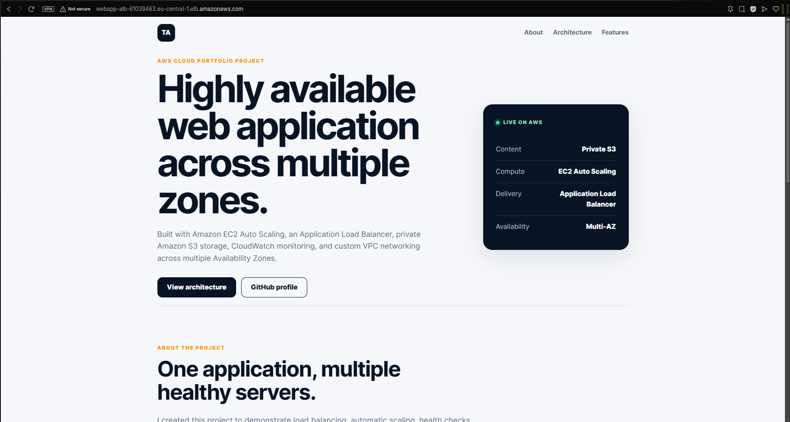

### VPC Resource Map

The custom VPC contains public and private subnets across two Availability Zones, separate route tables, an Internet Gateway and an S3 Gateway Endpoint.

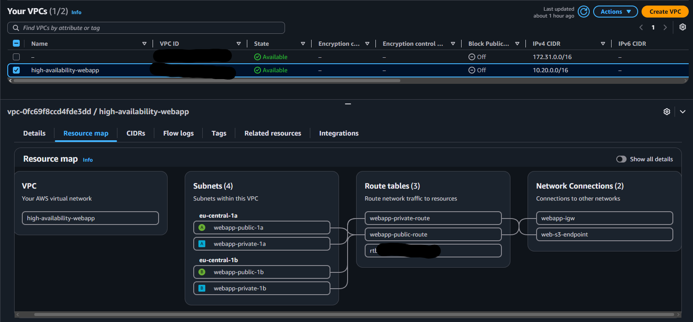

### Public Route Table

The public route table sends internet traffic to the Internet Gateway.

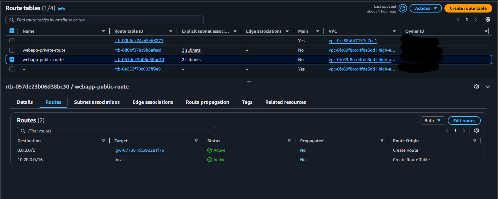

### Private Route Table

The private route table contains the local VPC route and the S3 route. It does not contain a default internet route.


### S3 Gateway Endpoint

The gateway endpoint provides private S3 connectivity for the EC2 web servers.

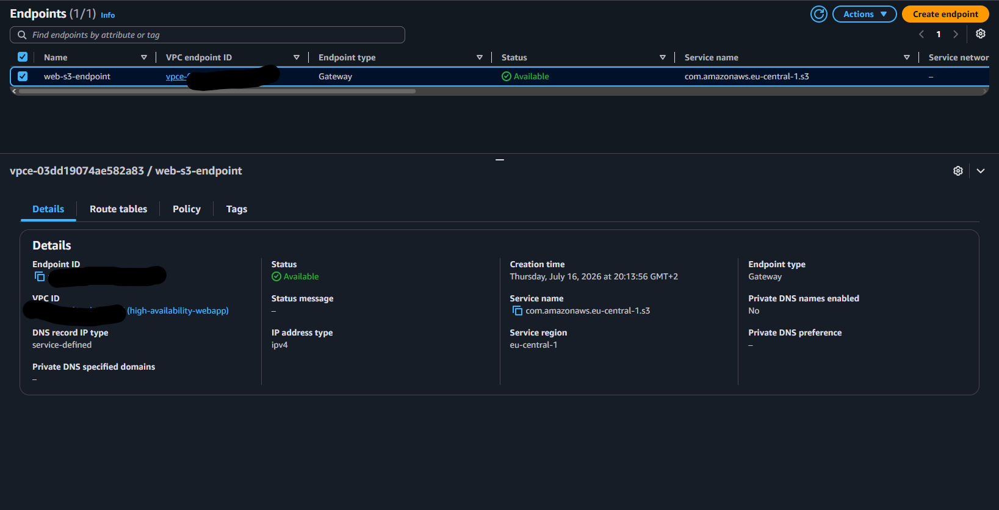

### Private S3 Frontend Files

The shared frontend files are stored inside the S3 bucket.

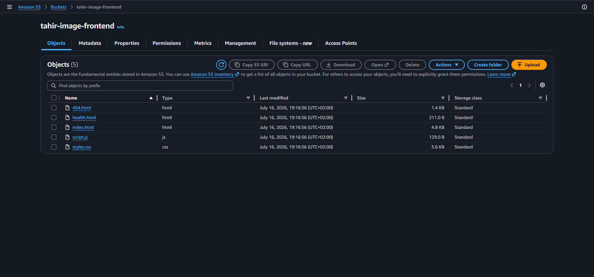

### EC2 IAM Role

The EC2 role uses a customer-managed policy that grants read access to the frontend bucket.

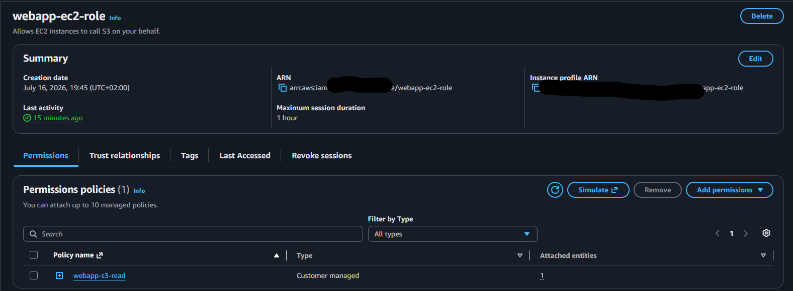

### Custom EC2 AMI

A custom AMI was created after installing Apache and configuring the website.

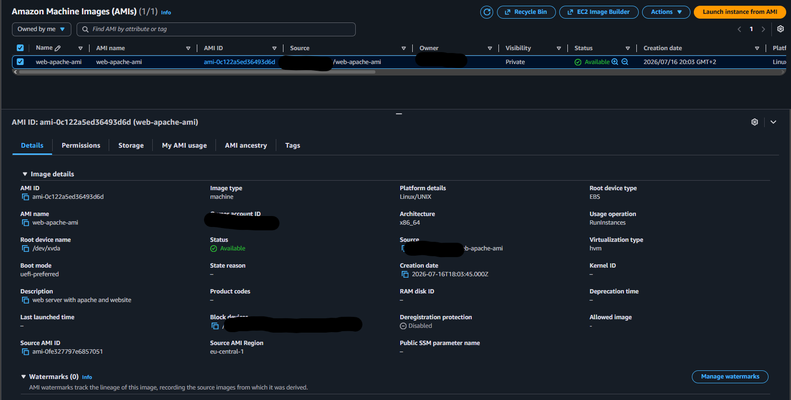

### Application Load Balancer

The internet-facing ALB operates across two Availability Zones.

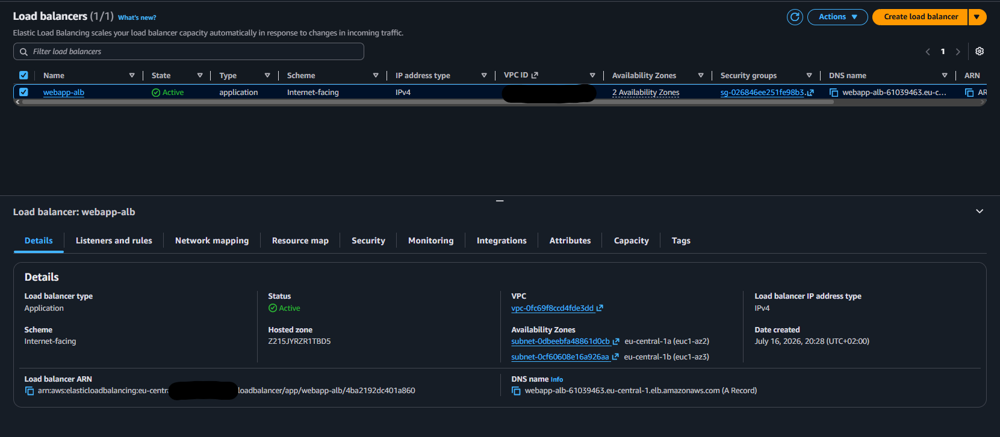

### Auto Scaling Configuration

The Auto Scaling Group maintains two instances and can scale up to four.

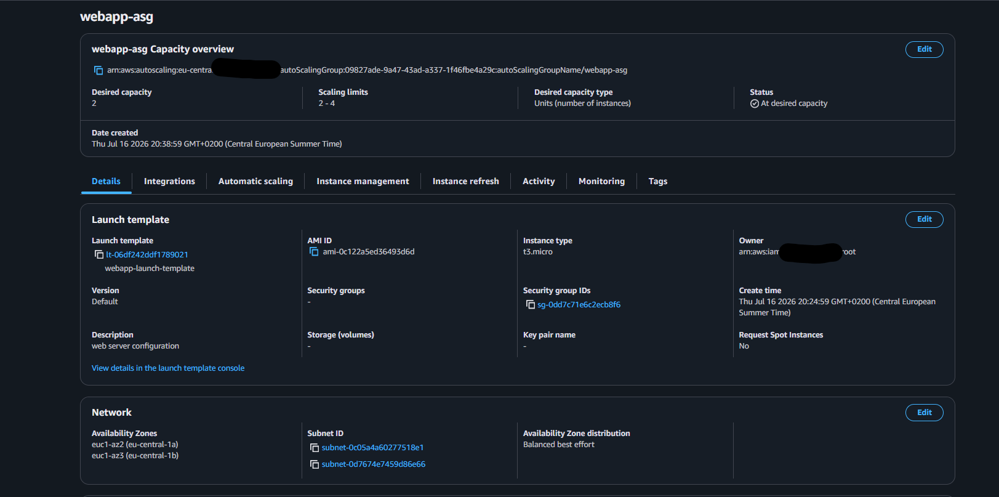

### Private Multi-AZ EC2 Instances

The EC2 instances run in separate Availability Zones and do not have public IPv4 addresses.

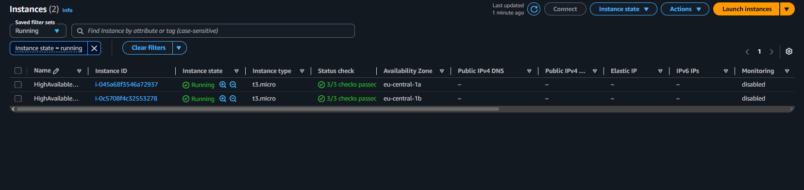

### Initial Healthy Targets

Before the recovery test, the target group contained two healthy EC2 targets.

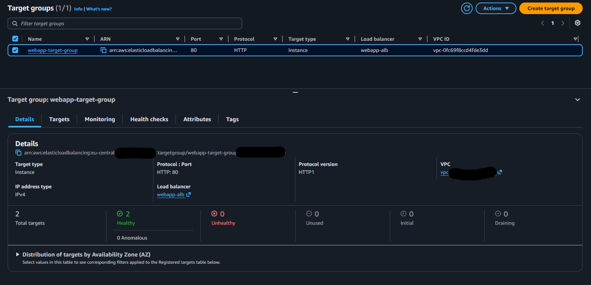

### Auto Scaling Replacement

After one instance was terminated, the Auto Scaling Group launched a replacement.

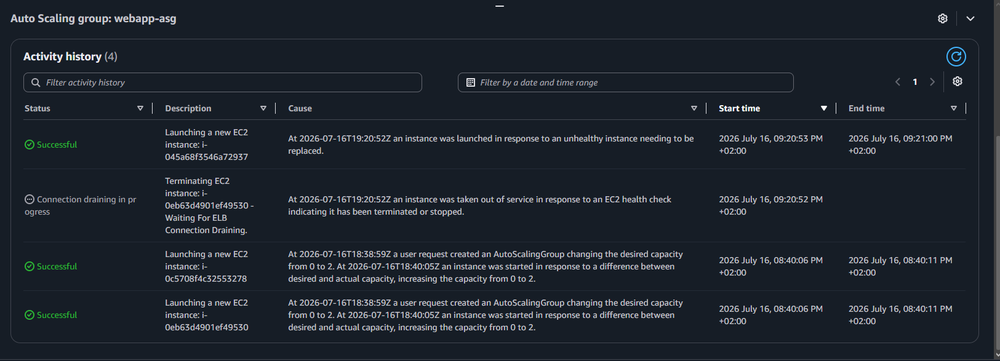

### CloudWatch Alarm During Failure

The CloudWatch alarm entered the alarm state when fewer than two targets were healthy.

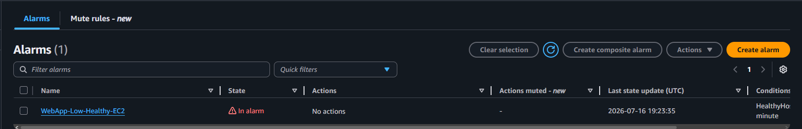

### Recovered Healthy Targets

The target group returned to two healthy targets after the replacement instance passed its health check.

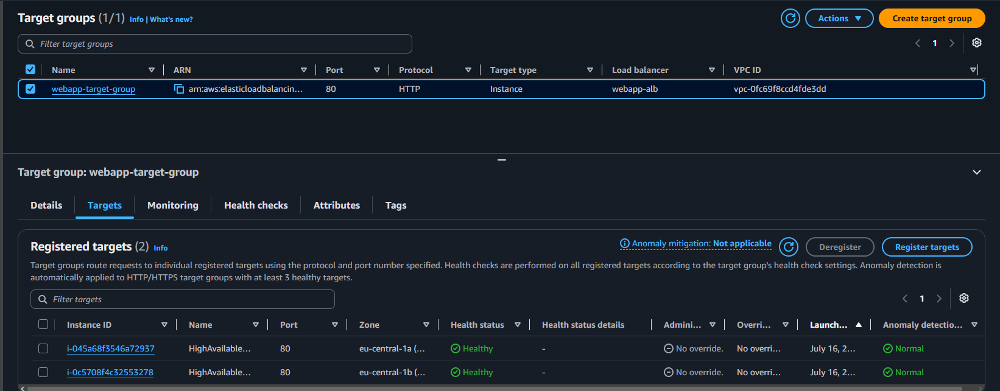

### CloudWatch Alarm Recovery

The alarm returned to the OK state after the application recovered.

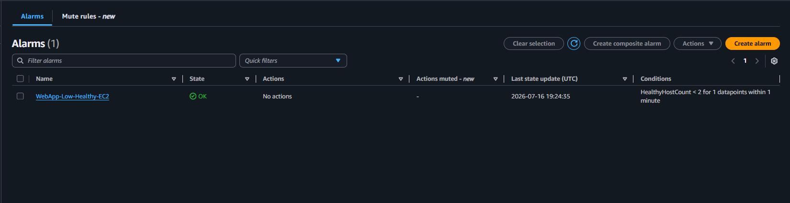

### CloudWatch Dashboard

The dashboard displays ALB traffic, target health, response time, Auto Scaling capacity and EC2 CPU utilization.

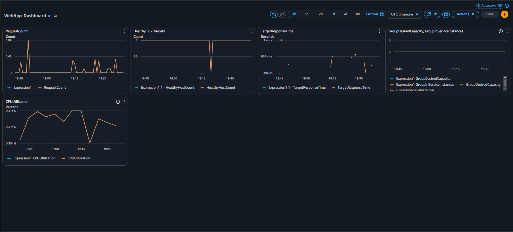

## Challenges and Solutions

### Private EC2 Access to S3

The EC2 instances required access to the website files but had no public IP addresses. A NAT Gateway would have added cost and more complications for me.

I solved this by creating an S3 Gateway VPC Endpoint and associating it with the private route table.

### Consistent EC2 Configuration

Manually installing and configuring Apache on every instance would not work with Auto Scaling.

I solved this by creating a custom AMI containing the configured Apache web server. The launch template uses this AMI whenever Auto Scaling creates an instance.

### Automatic Failure Recovery

The application needed to continue operating when an instance failed.

The ALB health checks removed unhealthy instances from traffic, while Auto Scaling launched replacements to restore the desired capacity.

## Cost Management and Cleanup

After I tested and collected the evidence, I removed the resources as they would accumulate costs that I am not able to pay.

I retained a small S3 bucket because it is shared with my earlier AWS web projects.

## Skills Demonstrated

- Amazon EC2
- Apache HTTP Server
- EC2 Auto Scaling
- Application Load Balancer
- Target groups and health checks
- Custom AMIs
- Launch templates
- Amazon VPC
- Public and private subnets
- Route tables and Internet Gateways
- S3 Gateway VPC Endpoints
- IAM roles and least-privilege policies
- Amazon CloudWatch dashboards and alarms
- Multi-AZ architecture
- High-availability testing
- AWS cost-aware cleanup

## Possible Future Improvements

- Add HTTPS using AWS Certificate Manager
- Add a custom domain using Route 53
- Place CloudFront in front of the ALB
- Add AWS WAF protection
- Create the infrastructure using Terraform or AWS CloudFormation
- Use AWS Systems Manager for private instance administration
- Add automated deployment from GitHub Actions
